# StayPilot — AI Powered Hotel Discovery & Travel Intelligence Platform

StayPilot is a modern **ASP.NET Core Web API + MVC** travel platform built with a clean layered architecture. The project focuses on hotel discovery, AI-assisted travel planning, admin-managed content, API health monitoring, and provider-ready hotel data integration.

This project was developed as a portfolio-level application to demonstrate real-world software architecture, API-first development, admin panel management, authentication, AI foundation, and scalable external provider integration.

---

## Project Overview

StayPilot is not just a basic hotel listing website. It is designed as a complete travel intelligence platform where users can search hotels, explore destinations, ask an AI assistant for travel recommendations, read travel insights, and send contact messages.

Admin users can manage website content, monitor system status, review contact messages, and inspect AI conversation logs through a secure admin panel.

---

## Main Features

* Premium public landing page
* Dynamic hero section
* Hotel search and hotel detail pages
* Featured destination cards
* AI Travel Assistant
* AI conversation logging
* Travel insight / blog content
* Contact form connected to API
* Secure admin login
* Admin dashboard
* Admin CMS management
* API health and database status monitoring
* Swagger API documentation
* Mock hotel provider fallback
* RapidAPI Booking provider-ready architecture

---

## Technologies Used

* ASP.NET Core MVC
* ASP.NET Core Web API
* Entity Framework Core
* SQL Server
* AutoMapper
* Cookie Authentication
* Role-Based Authorization
* Razor Views
* DTO-based architecture
* HttpClientFactory
* Swagger / OpenAPI
* Layered Architecture
* Provider Pattern
* Mock AI Provider
* Mock Hotel Provider
* RapidAPI Booking provider-ready structure

---

## Architecture

StayPilot follows a clean layered architecture:

```text
StayPilot.Web
        ↓
StayPilot.API
        ↓
StayPilot.Application
        ↓
StayPilot.Infrastructure
        ↓
SQL Server / External Providers
```

The Web project does not directly access the database. All operations are routed through API services and application services.

### Core Flow

```text
Entity
  ↓
DTO
  ↓
Service
  ↓
API Controller
  ↓
Web Service
  ↓
MVC Controller
  ↓
Razor View
```

This structure keeps the project clean, scalable, and easier to maintain.

---

## Solution Structure

```text
StayPilot
│
├── StayPilot.API
│   ├── Controllers
│   ├── Extensions
│   ├── Middlewares
│   └── Program.cs
│
├── StayPilot.Application
│   ├── DTOs
│   ├── Interfaces
│   ├── Mappings
│   └── Services
│
├── StayPilot.Domain
│   ├── Entities
│   └── Enums
│
├── StayPilot.Infrastructure
│   ├── Context
│   ├── ExternalServices
│   └── Repositories
│
├── StayPilot.Web
│   ├── Areas
│   │   └── Admin
│   ├── Controllers
│   ├── Services
│   ├── ViewModels
│   ├── Views
│   └── wwwroot
│       └── Screenshots
```

---

# Feature Showcase

## 1. Premium Home Page & Hotel Search

The public website starts with a modern hero section, navigation links, and a hotel search form. Users can search hotels by destination, check-in date, check-out date, adult count, and room count.

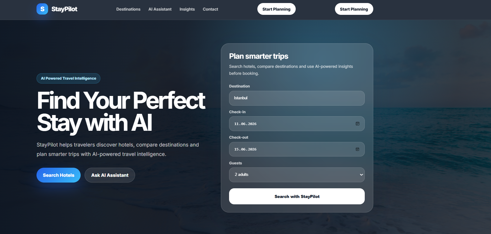

---

## 2. Featured Destinations

Featured destinations are dynamically displayed on the public landing page. Each destination includes city, country, image, highlight text, average hotel price, and description.

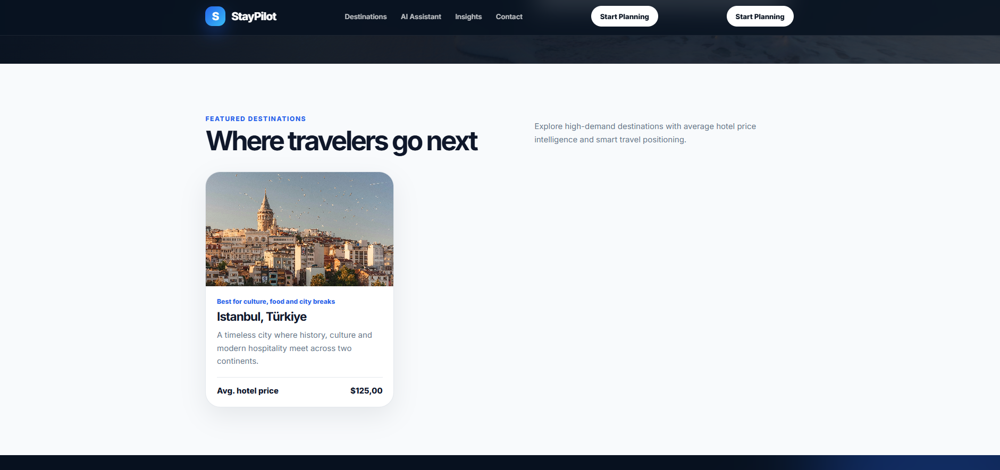

---

## 3. Admin Destination Management

Admin users can create, update, activate, deactivate, feature, and delete destination cards. These records are managed through the admin panel and rendered on the public website.

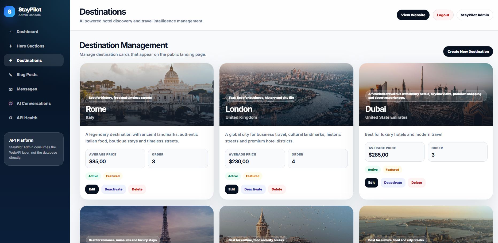

---

## 4. AI Assistant Preview

The landing page includes an AI assistant preview section that explains how StayPilot helps users make smarter travel decisions.

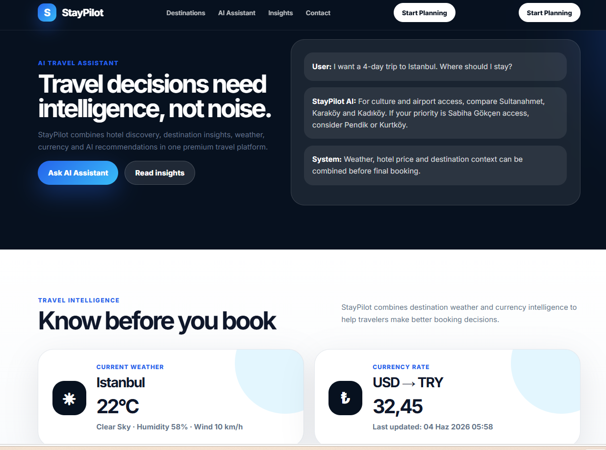

---

## 5. Hotel Search Results

Users can search for hotels through the public website. The search result page displays hotel cards with image, hotel name, location, rating, price, and action buttons.

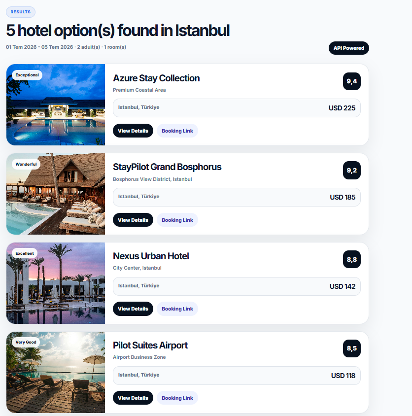

---

## 6. Hotel Detail Page

Each hotel has a detail page with hero image, gallery, facilities, rating information, location intelligence, and booking action panel.

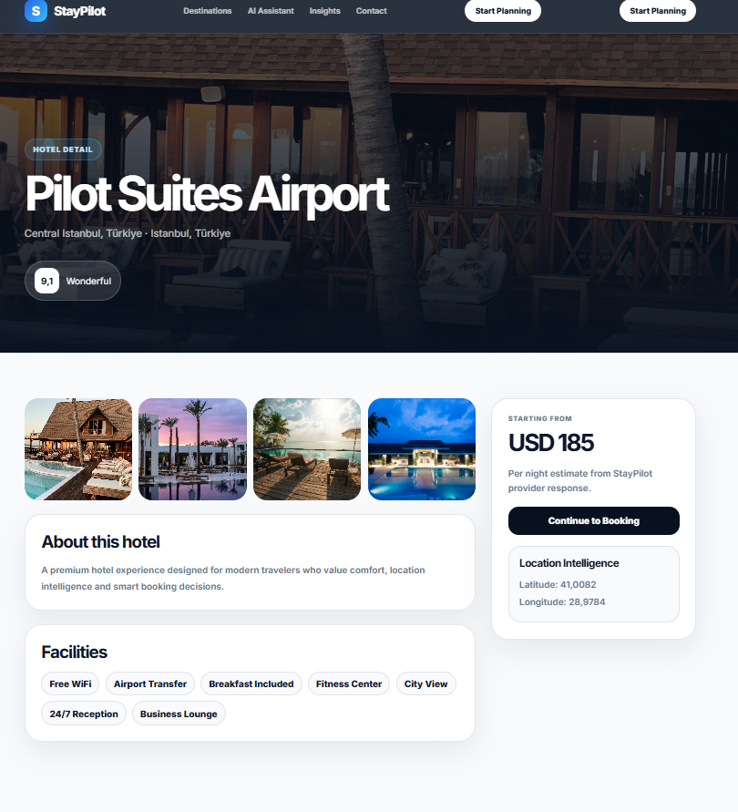

---

## 7. AI Travel Assistant

Users can ask travel-related questions such as where to stay, what to consider before booking, and how to plan a trip. The current version uses a mock AI provider and is ready for real AI provider integration.

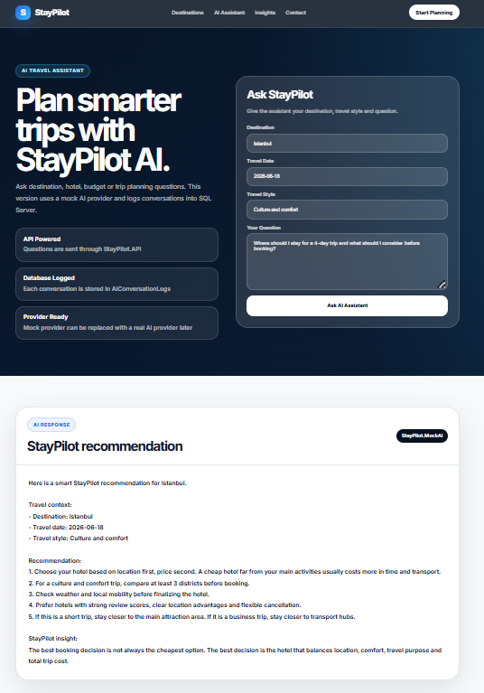

---

## 8. AI Conversation Logging

AI assistant conversations are stored and can be reviewed from the admin panel. This provides an audit and monitoring layer for AI interactions.

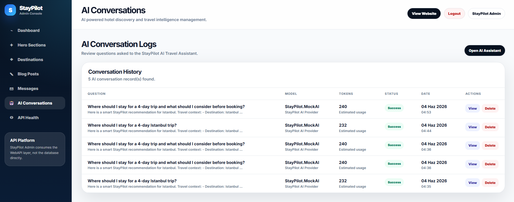

---

## 9. Travel Insights

StayPilot includes travel insight content that can be managed as blog posts. These insights are displayed on the public website to support travel planning and content marketing.

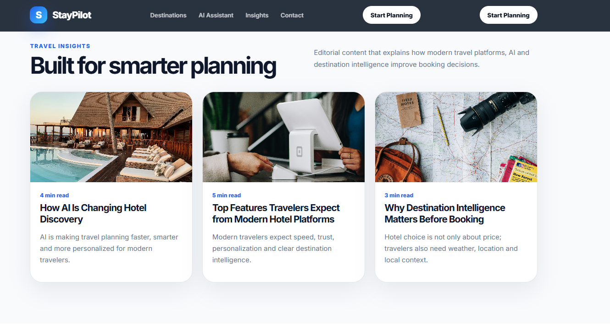

---

## 10. Contact Form

The public contact form sends messages through the Web layer to the API. Messages are stored in SQL Server and can be managed from the admin panel.

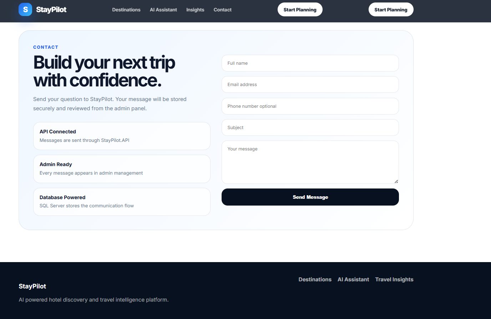

---

## 11. Admin Authentication

The admin panel is protected with cookie-based authentication and role-based authorization. Public users cannot access admin routes without signing in.

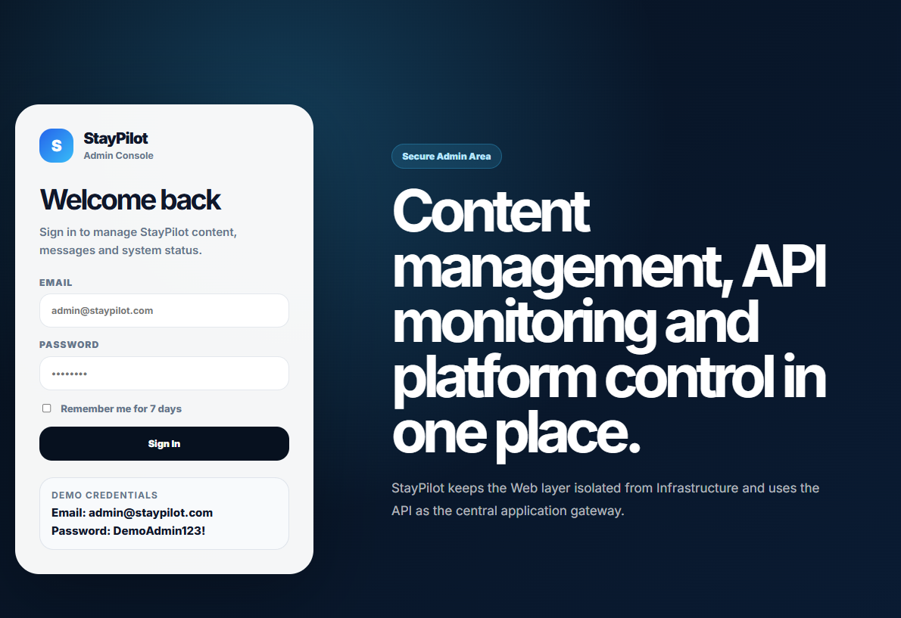

---

## 12. Admin Dashboard

The dashboard provides a high-level overview of the platform, including content statistics, recent messages, and system information.

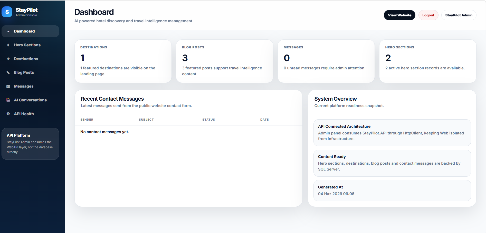

---

## 13. Hero Section Management

Hero sections can be managed from the admin panel. Admin users can create, update, activate, deactivate, and delete hero records.

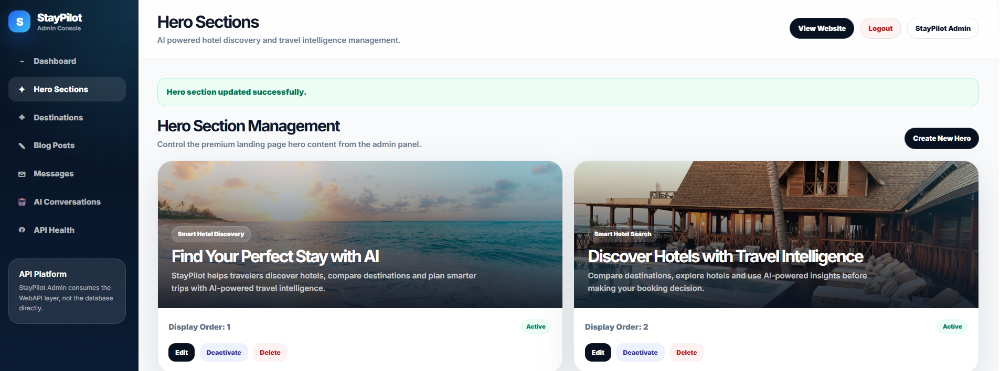

---

## 14. API Health Monitoring

The admin panel includes a system health page that checks API status and database connection status.

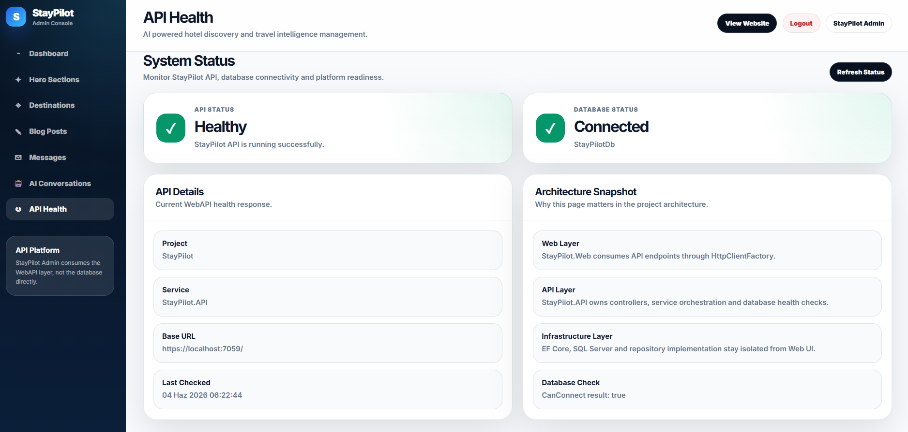

---

## 15. Swagger API Documentation

StayPilot exposes API endpoints through Swagger / OpenAPI. This makes the API layer easy to test and demonstrate.

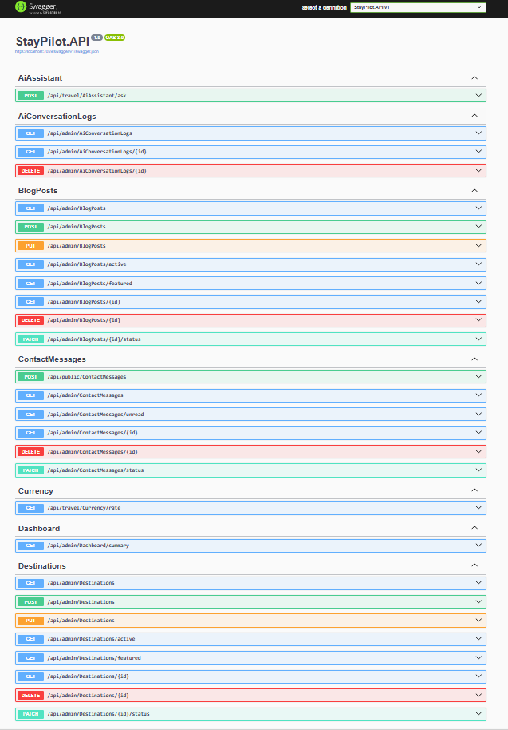

---

# Admin Panel Modules

## Dashboard

The dashboard shows a platform overview including:

* Total hero sections
* Total destinations
* Total blog posts
* Total contact messages
* Recent contact messages
* System overview

## Hero Sections

Admin users can manage landing page hero content without changing code.

Supported operations:

* List hero sections
* Create hero section
* Update hero section
* Activate / deactivate
* Delete hero section

## Destinations

Admin users can manage featured destination cards.

Supported operations:

* List destinations
* Create destination
* Update destination
* Mark as featured
* Activate / deactivate
* Delete destination

## Blog Posts

Admin users can manage travel insight content.

Supported operations:

* List blog posts
* Create blog post
* Auto-generate slug
* Update blog post
* Mark as featured
* Activate / deactivate
* Delete blog post

## Contact Messages

Messages sent from the public contact form are stored and managed from the admin panel.

Supported operations:

* List messages
* View message detail
* Mark as read
* Archive message
* Delete message

## AI Conversation Logs

Every AI assistant question and answer can be logged and reviewed.

Supported operations:

* List AI conversations
* View conversation details
* Review estimated token usage
* Delete conversation log

## API Health

The system status page displays:

* API status
* Database connection status
* API base URL
* Last checked time
* Architecture snapshot

---

# Hotel Provider Architecture

StayPilot uses a provider-based hotel data architecture.

```text
IHotelProviderClient
    ├── MockHotelProviderClient
    └── RapidApiBookingHotelProviderClient
```

This allows the system to switch between mock data and real provider data without rewriting the Web UI, MVC controllers, or API controllers.

## Current Provider Strategy

* `MockHotelProviderClient` keeps the project stable during development.
* `RapidApiBookingHotelProviderClient` is prepared for RapidAPI Booking-style integration.
* The architecture can be extended later for Amadeus or official Booking.com Demand API integration.

## Provider Configuration

Development credentials should be stored locally.

```json
{
  "HotelProvider": {
    "ProviderName": "RapidApiBooking",
    "RapidApiKey": "YOUR_LOCAL_KEY",
    "RapidApiHost": "booking-com15.p.rapidapi.com"
  }
}
```

For public repository safety, the default provider can remain as Mock:

```json
{
  "HotelProvider": {
    "ProviderName": "Mock",
    "RapidApiKey": "",
    "RapidApiHost": ""
  }
}
```

---

# Security Notes

API keys, tokens, passwords, and connection strings should not be committed to GitHub.

Recommended local-only file:

```text
appsettings.Development.json
```

Recommended `.gitignore` rule:

```gitignore
**/appsettings.Development.json
```

The project is designed to keep external API credentials outside the public repository.

---

# Authentication

The admin panel uses cookie-based authentication.

Protected admin routes:

```text
/Admin/Dashboard
/Admin/HeroSections
/Admin/Destinations
/Admin/BlogPosts
/Admin/ContactMessages
/Admin/AiConversationLogs
/Admin/ApiHealth
```

Login route:

```text
/Admin/Auth/Login
```

Logout is handled through a secure POST action with antiforgery token.

---

# API Endpoints

## Health

```http
GET /api/Health
GET /api/Health/database
```

## Hotels

```http
POST /api/Hotels/search
GET /api/Hotels/{hotelId}
```

## AI Assistant

```http
POST /api/travel/AiAssistant/ask
```

## Weather

```http
GET /api/travel/Weather/current
```

## Currency

```http
GET /api/travel/Currency/rate
```

## Admin Dashboard

```http
GET /api/admin/Dashboard/summary
```

## Admin Content Management

```http
GET    /api/admin/HeroSections
POST   /api/admin/HeroSections
PUT    /api/admin/HeroSections
DELETE /api/admin/HeroSections/{id}

GET    /api/admin/Destinations
POST   /api/admin/Destinations
PUT    /api/admin/Destinations
DELETE /api/admin/Destinations/{id}

GET    /api/admin/BlogPosts
POST   /api/admin/BlogPosts
PUT    /api/admin/BlogPosts
DELETE /api/admin/BlogPosts/{id}
```

## Admin Communication

```http
GET    /api/admin/ContactMessages
GET    /api/admin/ContactMessages/{id}
PATCH  /api/admin/ContactMessages/status
DELETE /api/admin/ContactMessages/{id}
```

## Admin AI Logs

```http
GET    /api/admin/AiConversationLogs
GET    /api/admin/AiConversationLogs/{id}
DELETE /api/admin/AiConversationLogs/{id}
```

---

# Example Hotel Search Request

```json
{
  "destination": "Istanbul",
  "checkInDate": "2026-07-01",
  "checkOutDate": "2026-07-05",
  "adultCount": 2,
  "roomCount": 1,
  "childCount": 0,
  "minPrice": null,
  "maxPrice": null,
  "page": 1
}
```

---

# Example AI Assistant Request

```json
{
  "question": "Where should I stay for a 4-day Istanbul trip?",
  "destination": "Istanbul",
  "travelDate": "2026-07-01",
  "travelStyle": "Culture and comfort"
}
```

---

# Database Modules

The project uses SQL Server with Entity Framework Core.

Main database modules:

* HeroSections
* Destinations
* BlogPosts
* ContactMessages
* AiConversationLogs

---

# How to Run the Project

## 1. Clone the Repository

```bash
git clone https://github.com/SavashSheren/StayPilot.git
```

## 2. Open the Solution

Open the solution in Visual Studio.

## 3. Configure SQL Server

Update the connection string in `appsettings.json` or local development settings.

```json
{
  "ConnectionStrings": {
    "DefaultConnection": "Server=YOUR_SERVER;Database=StayPilotDb;Trusted_Connection=True;TrustServerCertificate=True;"
  }
}
```

## 4. Apply Database Migrations

```bash
Update-Database
```

## 5. Run Both Projects

Run these projects together:

```text
StayPilot.API
StayPilot.Web
```

## 6. Open the Application

Public website:

```text
https://localhost:7020
```

Swagger:

```text
https://localhost:7059/swagger
```

Admin panel:

```text
https://localhost:7020/Admin/Auth/Login
```

---

# Development Highlights

This project demonstrates:

* API-first development
* MVC Web UI consuming internal API
* Clean layered architecture
* DTO-driven communication
* Admin-controlled CMS content
* Cookie authentication
* AI assistant foundation
* AI conversation logging
* Provider pattern for hotel data
* Mock provider fallback
* RapidAPI Booking provider-ready integration
* API health monitoring
* Swagger documentation
* Professional UI design

---

# Future Improvements

Planned improvements:

* Real hotel detail endpoint integration
* Real hotel photo endpoint integration
* Amadeus Hotel API provider
* Official Booking.com Demand API provider
* Advanced hotel filters
* Hotel favorites
* Reservation workflow
* Email notification system
* Admin analytics dashboard
* Real AI provider integration
* Multi-language support
* Cloud deployment

---

# Project Status

StayPilot currently includes a complete Web + API + Admin foundation.

The application is functional with mock hotel data and provider-ready real hotel API architecture. It is designed to be extended into a production-level travel intelligence platform.

---

# Author

Developed by **Savaş Şeren**.
